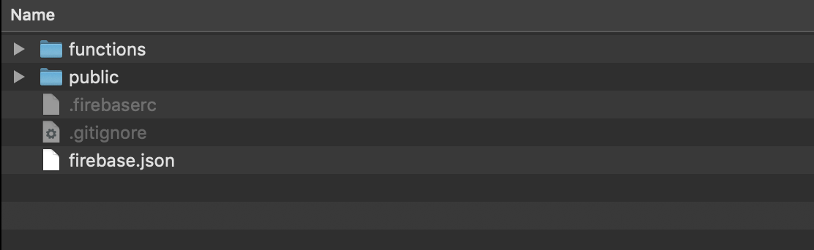
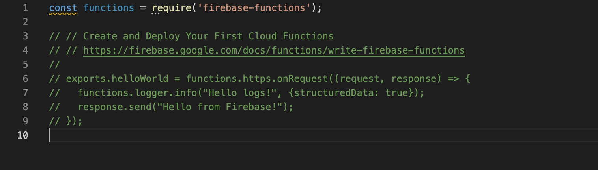
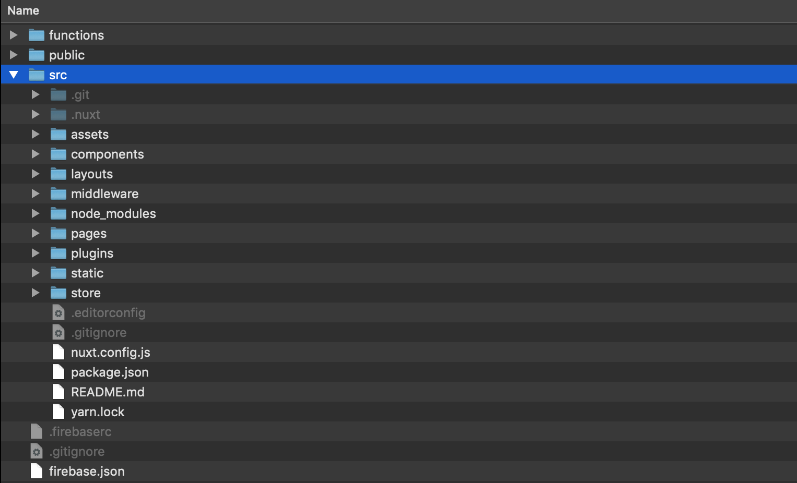

I created this website from scratch. Instead of the usual Wordpress site or any existing headless CMS, I chose to build it from the ground up (with a little help from other exiting projects) using Nuxt.js as the foundation. Nuxt.js, promised being an intuitive, yet proweful framework for building Vue.js applications. After trying it out for about half an hour, Nuxt.js and Vue.js felt most intuitive and fun, compared to its alternatives Angular or React, especially in terms rendering content from the server (SSR), which was a crucial reason to pick Nuxt.js

Additionally, I wanted to deploy the app to firebase functions, as I was planning to use Firebase Auth, Firestore in combination with Firebase hosting already and wanted everything in one place. Firebase offers a great selection of products that really simplify app developments (also web apps), and has a pretty generous free tier, so I was very interested to learn the tools as part of this project.

In this article I'll share my approach of making this happen. I'll be using Nuxt.js, following the [Nuxt.js installation guide](https://nuxtjs.org/docs/2.x/get-started/installation), as well as [Firebase](https://firebase.google.com/docs/web/setup), using the Firebase CLI to set up the projects template and deploy to Firebase hosting.

I'm not going to run through these steps in too much detail as there's plenty of good documentation on it, plus, I've created a [template repository](https://github.com/benmayer/nuxt-ssr-firebase-template) on Github for anyone interested in creating a similar setup.

## Getting started

First, you will have to create a Firebase account and set up a [firebase project](https://console.firebase.google.com/), following [these steps in the firebase setup guide](https://firebase.google.com/docs/web/setup). Make sure you upgrade from the Free "Spark" plan to the Pay as you go "Blaze" plan, as you'll need this to deploy your app later.

Now, you will have to set up setup up your local project folder. Create a directory with your project name:

```
$ mkdir <my-firebase-nuxt-project>
$ cd <my-firebase-nuxt-project>
```

## Install Firebase

Install Firebase CLI - if you don't have it installed already - log in and initiate firebase:

```
$ firebase login
$ firebase init
```

Use the following installation defaults if you're unsure which to choose from: during the installation:

1. Choose Firebase functions and hosting
2. Choose the project you set up in the first step, or create new one, and give it an ID and name. This will be your project in the [Google Firebase Console](https://console.firebase.google.com/).
3. Choose Javascript
4. Skip ESLint
5. Don't install dependencies now, as we'll do that later
6. Choose 'public' as your default public folder. (This is where the static files go later)
7. Don't configure as single page app (don't rewrite all urls to the index.html files)
8. Skip automatic builds and deploys with Github

Congratulations! Your Firebase setup should be complete and will have created a folder structure that looks something like this:



Remember this folder structure as it is key to understanding the next steps. The server files sit in the `functions` folder, you'll see the index.js with the commented out "helloWorld" function:



This is where your Nuxt.js files go later, but first let's create a local nuxt.js project.

## Create Nuxt.js app

These next steps are base on the regular Nuxt.js installation from the [Nuxt.js installtion guide](https://nuxtjs.org/docs/2.x/get-started/installation).

Within the root directory of your 'my-firebase-nuxt-project' project create a new Nuxt.js instance called 'src' with the following command:

```
$ yarn create nuxt-app src
```

Using `src` in the command above will install the Nuxt project in the src folder, which is where we want it to sit - seperate from the firebase files. You can choose the the setup options as you please.

In order for the application to work, we need to generate all the files for the server and client. Generating the Nuxt files in the `src` directory will work out of the box, like with any other Nuxt project. Run

```
$ cd src
$ yarn build
```

It output should look should look something like this:



Notice the `.nuxt` folder within the `src` directory - these are your generated Nuxt files, with the `dist` folder containing both server and client files. You will need to put them into the correct locations for Firebase functions to know what to do with them. This is the key to deploying Nuxt to Firebase functions. We'll do this later.

## Connecting Nuxt to Firebase

Now that we have Firebase and Nuxt.js set up, let's connect the two. In `./functions/node.js` add the following code:

```js
const { Nuxt } = require('nuxt-start');

const nuxtConfig = require('../src/nuxt.config.js');

const config = {
  ...nuxtConfig,
  dev: false,
  debug: false
};

const nuxt = new Nuxt(config);

exports.ssrapp = functions.https.onRequest(async (req, res) => {
  await nuxt.ready();
  nuxt.render(req, res);
});
```

As you can see, we require an extra dependency in the functions folder: "nuxt-start" to create a server. Install all node modules, then add in the functions folder, and add the nuxt-start package:

```
$ cd ../functions
$ yarn install
$ yarn add nuxt-start
```

At this point firebase won't pick up any Nuxt files yet, as Firebase won't know what to look for.

Pay attention to the `exports.ssrapp` function in the code we copied above. In order for firebase to know what to do with this, we need to tell it to look for this function in the Firebase settings.

Replace the content of firebase.json file, in the root folder of your project, with the following:

```json
{
  "functions": {
    "source": "functions"
  },
  "hosting": {
    "public": "public",
    "ignore": [
      "firebase.json",
      "**/.*",
      "**/node_modules/**"
    ],
    "rewrites": [
      {
        "source": "**",
        "function": "ssrapp"
      }
    ]
  }
}
```

Your server is set up and you're pretty much ready to go. The only part that's missing is coping your Nuxt.js files to the right directory, for Firebase to find them, otherwise starting the server will result in a Internal Server Error.

For this we will need to copy our Nuxt.js files we generated earlier, when running the `$ yarn build` command from the `src` directory to our `functions` folder.

The server files need to sit in `/functions/.nuxt/dist/server`. In the root folder of your project run the following command:

```
$ mkdir -p functions/.nuxt/dist/
$ cp -r src/.nuxt/dist/server functions/.nuxt/dist/
```

We'll also need to provide the correct files for the client to load on the front-end. First we delete the default Firebase files in the public directory as we won't need them:

```
$ rm ./public/*
```

Then, copy all the static files for the client to the `public` directory, within a new `_nuxt` folder, as that's the default path for static Nuxt files.

```
$ mkdir -p public/_nuxt
$ cp -r src/.nuxt/dist/client/ public/_nuxt && cp -a src/static/. public/
```

You can now 'test' the Firebase functions on a local environment using the following command:

```
$ yarn serve --only functions,hosting
```

You should see firebase setting up a local environment for functions and hosting, and confirm the successful set up with the message: "All emulators are ready! View status and logs at http://localhost:4000". It should start the execution of "ssrapp", and confirm you local server is running on http://localhost:5000, and that it is serving local files from the "public" directory.

You're all set up.

All that's left is to deploy your app.

```
$ yarn deploy
```

Once everything is uploaded, you should receive a message: **✔ Deploy complete!**

That's it, you're ready to start working on your own Nuxt.js application, and deploying it to Firebase - it should look something like this [Demo](https://benmayer-nuxt-firebase.web.app/).

In order to save yourself manually copying the generated files every time you want to deploy we can set up some automation scrips. I've added them to the template of this project.

You can download the repository here [https://github.com/benmayer/nuxt-ssr-firebase-template](https://github.com/benmayer/nuxt-ssr-firebase-template)
