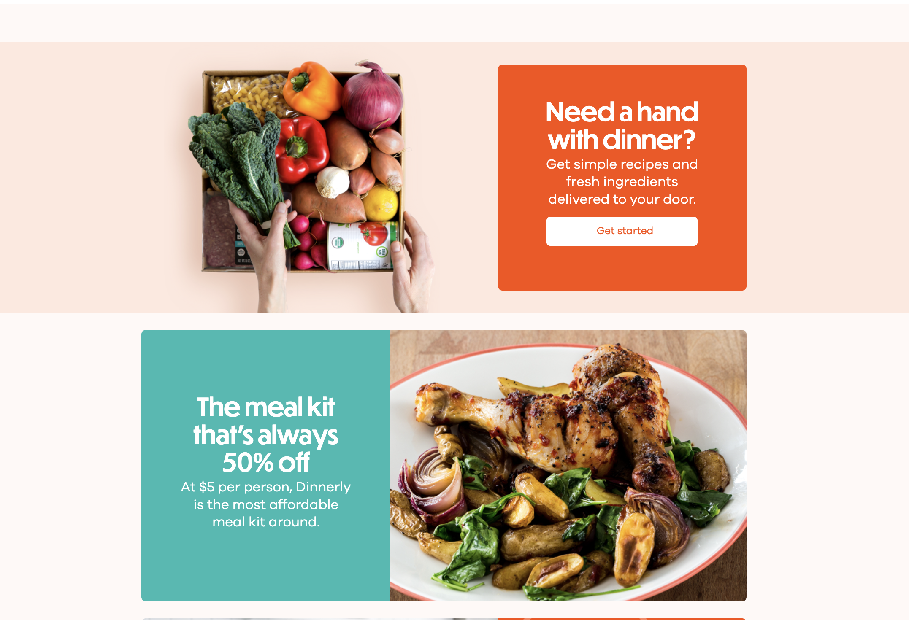
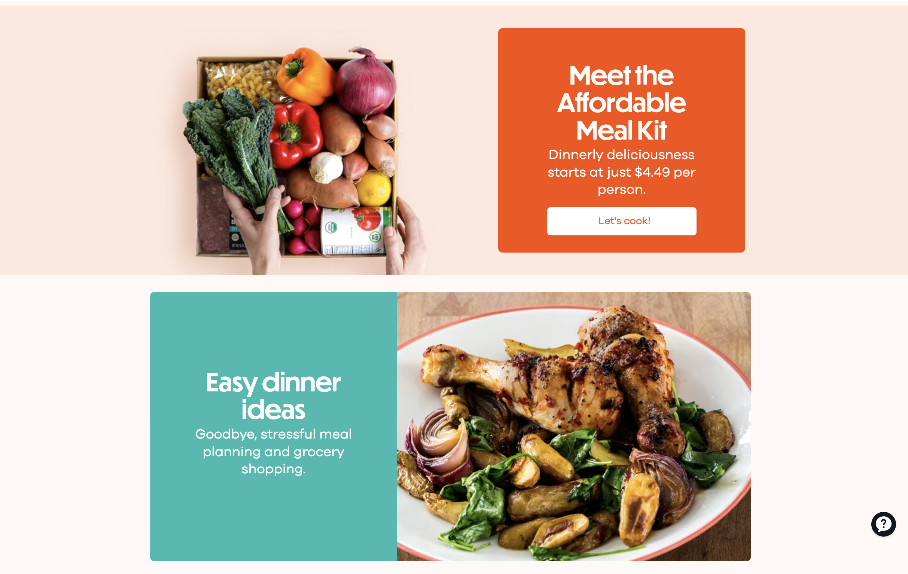

## The cheapest meal kit on the market

Dinnerly is the no-frills meal kit from the makers of Marley Spoon. Same idea — pick recipes, get the ingredients delivered, cook at home — but at roughly half the price. It launched in the US in 2017 and in Australia in 2018, and it's still going today, over 8 years later.

### My Role

Product Manager for Web and Mobile Apps, across Marley Spoon and Dinnerly brands. The decision to launch Dinnerly as an experiment was made just before my time — the website was already operational when I joined. I owned the launch of the Dinnerly iOS app, and later the Android app, and continuously iterated on improving product margins.

### Launching MVP apps to fix the cooking experience

Dinnerly was born out of one piece of customer feedback that came up at Marley Spoon no matter what the team shipped: "It's too expensive." The answer was a meal kit with everything non-essential stripped out — simpler recipes with fewer ingredients, less packaging, and no printed recipe cards in the box. A fake-door test with churned Marley Spoon customers showed the strongest interest in the US, so the website launched there first, as a rebranded copy of the Marley Spoon site running on the same infrastructure.

By the time I joined, the website was live and orders were coming in, but Dinnerly didn't have an app yet. Since Dinnerly customers didn't receive recipe cards in the box, recipes lived on the website only, and the cooking experience wasn't ideal. Together with the engineering team, I devised a plan to launch the Dinnerly app as quickly as possible to improve that experience for our early adopters.

**Cutting the recipe card saved money but broke the cooking experience.** Existing subscribers needed a better way to read recipes at the stove far more urgently than new users needed an app to sign up — cooking was the day-to-day pain, everything else (managing the subscription, choosing meals) could wait. I shipped a cut-down first version focused purely on letting subscribers access and read their recipes. That got the app into customers' hands several weeks earlier than a full launch would have, and closed the biggest gap in the Dinnerly experience.

### Pricing experiments reduced customer acquisition cost

Dinnerly started out at $5 per serving — that was the challenge the team had set itself: can we build a meal kit for $5 a serving? I ran an experiment displaying the price at $4.99 per serving instead. This increased conversion considerably, so we switched to $4.99 in 2018.

### Driving home the main message

A big advantage Dinnerly's brand had over Marley Spoon was a clear and bold USP: "It's the cheapest meal kit on the market." I devised a series of A/B tests to drive this message home during the checkout flow, reminding customers at every step of the great value Dinnerly offered.

### Dinnerly outgrew Marley Spoon on order volume

Increasing conversion — and therefore lowering acquisition cost — enabled us to reduce the price per serving again in 2019, to $4.49, which further increased acquisition numbers.

Dinnerly went on to overtake Marley Spoon in US order volume and is still operating today. The app remains a core part of the product.

*(I'm intentionally keeping detailed numbers private so as not to share proprietary information.)*
