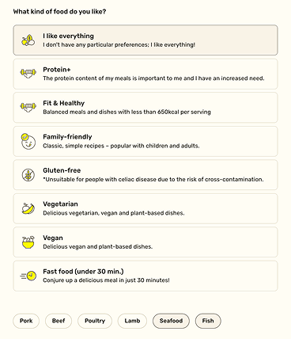

## Product Manager Customer Experience at Marley Spoon

I joined Marley Spoon in August 2018, just after they went public on the Australian Stockmarket.

### My Role

Product Manager for Web and Mobile Apps (Android and iOS native), across Marley Spoon and Dinnerly brands

### The Team

This was a big team consisting of 4 backend, 3 Frontend, 3 Mobile engineers, 2 team leads, sharing a lot of the same team rituals, but split across 2 main domains:

**Growth:** 2 backend 2 Frontend 1 teamlead

**Retention:** 2 backend 1 Frontend 2 mobile, 1 team lead

### Notable Projects: Improving customer retention

#### Background

Early on in Marley Spoon's development, a decision had been made to offer subscriptions with the option to opt out, rather than individually "option in" for a new order every week. It had significantly increased MRR.

At the time, just before i joined, customer churn had been a critical issue though. Users blamed a limited menu (8 options/week) and the decision had been made to expand the menu to 20 options. Once rolled out, this barely reduced cancellations though.

As part of their subscription, users could skip weekly deliveries, but if they forgot to select recipes, the system assigned the same default meals to everyone.

Data analysis revealed two key insights:

- **Customization equaled retention:** Users who actively customized their boxes were significantly more likely to reorder.
- **New users were most vulnerable:** First-time subscribers rarely customized their orders, received default meals they didn't like, and disengaged.

#### Hypotheses & Discovery

1. **Hypothesis 1:** Personalized default meals based on a user's taste profile would reduce churn caused by un-customized boxes.
2. **Hypothesis 2:** Educating users and reminding them to customize would boost engagement.

While data showed that if the default meals matched to existing taste profiles by chance, the probability of retention increased significantly. However, building an automated recommendation algorithm was high-effort/high-cost, and worse, it wouldn't solve the core problem for *new* users who had no order history.

Qualitative research - observing users navigate the onboarding flow in usability interviews, confirmed the actual root cause: our onboarding flow failed to teach users that customization was even an option.

#### Execution & Solutions

- **Phase 1: Onboarding Education (Quick Win)** Tested modifying the primary sign-up CTA from *"Buy Now"* to *"Buy Now & Choose Meals."* This simple copy test drove an immediate lift in first-box customizations, confirming users simply needed better guidance. (A variation of this micro-copy remains live today 8 years later).
- **Phase 2: First-Box Guidance** Introduced a dedicated "Customize Your First Box" widget during onboarding. This significantly decreased the number of un-customized first orders and reduced immediate post-signup churn.
- **Phase 3: Taste Profiles for Ongoing Retention** To address churn among existing users (where email and push reminders were falling short, and often leading to orders being skipped), we launched explicit "Taste Profiles" ("Meat," "Vegetarian," "Healthy," etc.) during onboarding. Over time, we layered this explicit data with implicit user choice data and lookalike audience modeling.

#### Impact & Key Results

- **Reduced First-Box Churn:** Education and widget onboarding drastically increased first-time customization rates.
- **Sustained MRR Growth:** Automated taste-matched defaults drastically reduced churn for un-customized deliveries among existing users, leading to a significant increase in Monthly Recurring Revenue (MRR).
